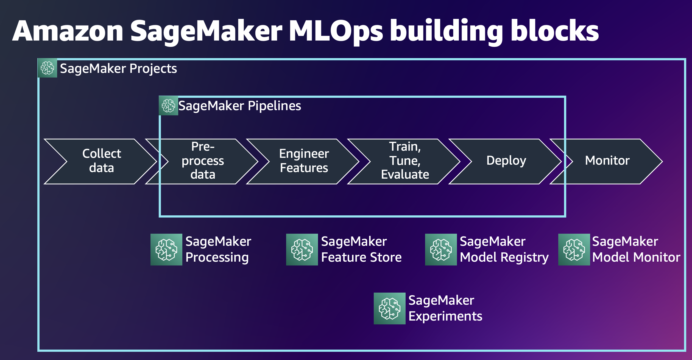
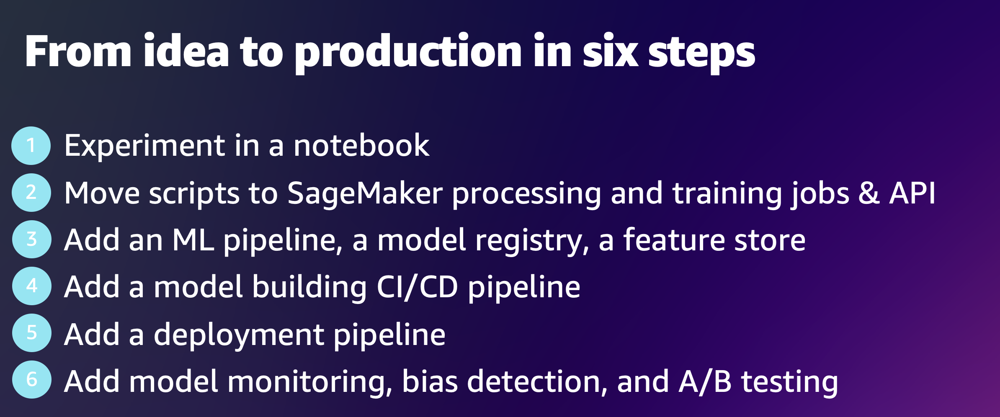
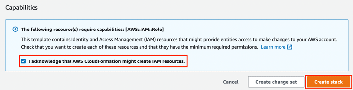
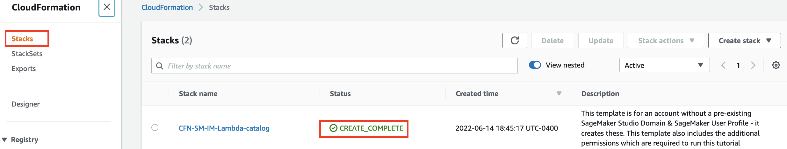
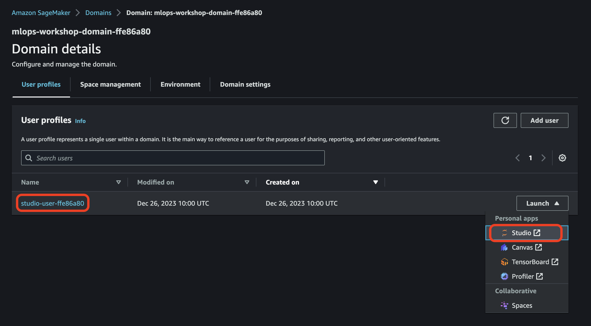
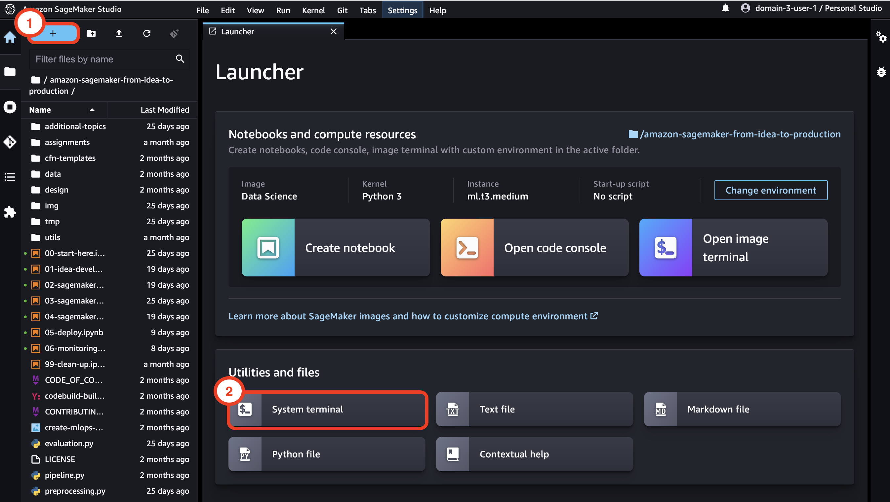
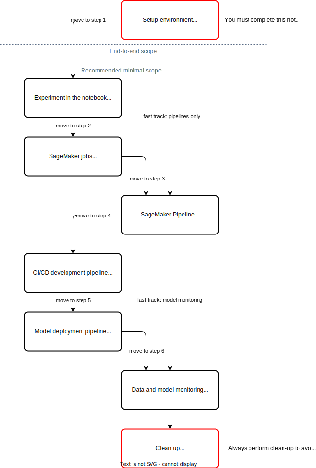

# Amazon SageMaker MLOps: from idea to production in six steps
This repository contains a sequence of simple notebooks demonstrating how to move from an ML idea to production by using [Amazon SageMaker](https://aws.amazon.com/sagemaker).

The notebooks make use of SageMaker [processing](https://docs.aws.amazon.com/sagemaker/latest/dg/processing-job.html) and [training](https://docs.aws.amazon.com/sagemaker/latest/dg/train-model.html) jobs, and SageMaker MLOps features such as [SageMaker Pipelines](https://aws.amazon.com/sagemaker/pipelines/), [SageMaker Feature Store](https://aws.amazon.com/sagemaker/feature-store/), [SageMaker Model Registry](https://docs.aws.amazon.com/sagemaker/latest/dg/model-registry.html), [SageMaker Experiments](https://docs.aws.amazon.com/sagemaker/latest/dg/experiments.html), and [SageMaker Model Monitor](https://aws.amazon.com/sagemaker/model-monitor/).

You start with a simple notebook with basic ML code for data preprocessing, feature engineering, and model training, all local to the notebook. Each subsequent notebook builds on top of the previous and introduces one or several SageMaker MLOps features:



Each notebook also provides links to useful hands-on resources and proposes real-world ideas for additional development.

You follow along the six notebooks and develop your ML idea from an experimental notebook to a production-ready solution following the recommended MLOps practices:



## Additional topics
There are also additional hands-on examples of other SageMaker features and ML topics, like [A/B testing](https://docs.aws.amazon.com/sagemaker/latest/dg/model-validation.html), custom [processing](https://docs.aws.amazon.com/sagemaker/latest/dg/build-your-own-processing-container.html), [training](https://docs.aws.amazon.com/sagemaker/latest/dg/your-algorithms-training-algo.html) and [inference](https://docs.aws.amazon.com/sagemaker/latest/dg/your-algorithms-inference-main.html) containers, [debugging and profiling](https://docs.aws.amazon.com/sagemaker/latest/dg/train-debugger.html), [security](https://docs.aws.amazon.com/sagemaker/latest/dg/security.html), [multi-model](https://docs.aws.amazon.com/sagemaker/latest/dg/multi-model-endpoints.html) and [multi-container](https://docs.aws.amazon.com/sagemaker/latest/dg/multi-container-endpoints.html) endpoints, and [serial inference pipelines](https://docs.aws.amazon.com/sagemaker/latest/dg/inference-pipelines.html). Explore the notebooks in the folder `additional-topics` to test out these features.

## Getting started
For the full version of the instructions and detailed setup of the account refer to the public AWS workshop [Amazon SageMaker MLOps: from idea to production in six steps](https://catalog.us-east-1.prod.workshops.aws/workshops/741835d3-a2bf-4cb6-81f0-d0bb4a62edca/en-US).

### Prerequisites
You need an **AWS account**. If you don't already have an account, follow the [Setting Up Your AWS Environment](https://aws.amazon.com/getting-started/guides/setup-environment/) getting started guide for a quick overview.

### AWS Instructor-led workshop
If you participating in an AWS Immersion Day or a similar instructor-led event and would like to use a provided AWS account, please follow this [instructions](https://catalog.us-east-1.prod.workshops.aws/workshops/63069e26-921c-4ce1-9cc7-dd882ff62575/en-US/prerequisites/option1) how to claim your AWS account via Event Engine and how to start SageMaker Studio. 

❗ Skip the following steps **Set up Amazon SageMaker domain** and **Deploy CloudFormation template** if you use an AWS-provisioned account.

### Set up Amazon SageMaker domain
To run the notebooks you must use [SageMaker Studio](https://aws.amazon.com/sagemaker/studio/) which requires a [SageMaker domain](https://docs.aws.amazon.com/sagemaker/latest/dg/studio-entity-status.html).

#### Existing SageMaker domain
If you already have a SageMaker domain and would like to use it to run the workshop, follow the [SageMaker Studio setup guide](https://aws.amazon.com/getting-started/hands-on/machine-learning-tutorial-set-up-sagemaker-studio-account-permissions/) to attach the required AWS IAM policies to the IAM execution role used by your Studio user profile. For this workshop you must attach the following managed IAM policies to the IAM execution role of the user profile you use to run the workshop:
- `AmazonSageMakerFullAccess`
- `AWSCloudFormationFullAccess`
- `AWSCodePipeline_FullAccess`
- `AmazonSageMakerPipelinesIntegrations`

You can also [create a new user profile](https://docs.aws.amazon.com/sagemaker/latest/dg/domain-user-profile-add-remove.html) with a dedicated IAM execution role to use for this workshop.

#### Provision a new SageMaker domain
If you don't have a SageMaker domain or would like to use a dedicated domain for the workshop, you must create a new domain.

❗ If you have more than one domain in your account, consider the limit of the active domains in a Region in an account.

To create a new domain, you can follow the onboarding [instructions](https://docs.aws.amazon.com/sagemaker/latest/dg/gs-studio-onboard.html) in the Developer Guide or use the provided AWS CloudFormation [template](https://github.com/aws-samples/amazon-sagemaker-from-idea-to-production/blob/master/cfn-templates/sagemaker-domain.yaml) that creates a SageMaker domain, a user profile, and adds the IAM roles required for executing the provided notebooks.

❗ If you create a new domain via AWS Console, make sure you attach the following policies to the IAM execution role of the user profile:
- `AmazonSageMakerFullAccess`
- `AWSCloudFormationFullAccess`
- `AWSCodePipeline_FullAccess`
- `AmazonSageMakerPipelinesIntegrations`

❗ If you use the provided CloudFormation template for domain creation, the template creates an IAM execution role with the following policies attached:
- `AmazonSageMakerFullAccess`
- `AmazonS3FullAccess`
- `AWSCloudFormationFullAccess`
- `AWSCodePipeline_FullAccess`
- `AmazonSageMakerPipelinesIntegrations`

Download the [`sagemaker-domain.yaml` CloudFormation template](https://github.com/aws-samples/amazon-sagemaker-from-idea-to-production/blob/master/cfn-templates/sagemaker-domain.yaml).

This template creates a new SageMaker domain and a user profile named `studio-user`. It also creates the required IAM execution role for the domain. 

❗ This stack assumes that you already have a public VPC set up in your account. If you do not have a public VPC, see [VPC with a single public subnet](https://docs.aws.amazon.com/vpc/latest/userguide/VPC_Scenario1.html) to learn how to create a public VPC. 

❗ The template supports only `us-east-1`, `us-east-2`, and `us-west-1` Regions. Select one of those regions for deployment.

Open [AWS CloudFormation console](https://us-east-1.console.aws.amazon.com/cloudformation/home?region=us-east-1#/stacks/create). The link opens the AWS CloudFormation console in your AWS account. Check the selected region and change it if needed. 
- Select **Upload a template file** and upload the downloaded CloudFormation template, click **Next** 
- Enter the stack name, for example `sagemaker-from-idea-to-prod`, click **Next**
- Leave all defaults on this pane, click **Next**
- Select **I acknowledge that AWS CloudFormation might create IAM resources**, click **Submit**



On the **CloudFormation** pane, choose **Stacks**. It takes about 15 minutes for the stack to be created. When the stack is created, the status of the stack changes from `CREATE_IN_PROGRESS` to `CREATE_COMPLETE`. 



### Start SageMaker Studio
After signing into the AWS account, follow [Launch Studio Using the Amazon SageMaker Console](https://docs.aws.amazon.com/sagemaker/latest/dg/studio-launch.html#studio-launch-console) instructions to open Studio.

If you deployed the CloudFormation template or participate in an instructor-led event, use `studio-user` user profile to launch Studio:



Otherwise start Studio with a corresponding user profile which you'd like to use for this workshop.

### Download notebooks into your Studio environment
To use the provided notebooks you must clone the source code repository into your Studio environment.
In Studio open the Launcher window and start the system terminal:



Run the following command in the terminal:
```sh
git clone https://github.com/aws-samples/amazon-sagemaker-from-idea-to-production.git
```

The code repository will be downloaded and saved in your home directory in Studio.

### Start exploring
Navigate to the Studio file browser inside the folder `amazon-sagemaker-from-idea-to-production`. Open `00-start-here.ipynb` notebook and follow the instructions.

## How to use this workshop
You can do this workshop in two ways:
- Go through the provided notebooks, execute code cells sequentially, and follow the instructions and execution flow
- Write your own code with hands-on assignments and exercises

The following diagram shows the possible flows of the workshop:



### Execution mode
Use this mode if you're not familiar with Python programming and new to Jupyter notebooks. You follow each notebook `00-...`, `01-...`, ..., `06-...`and execute all code cells with `Shift` + `Enter`. The given instructions explain what code is doing and why. You need about two and half hours to run through all code cells in all notebooks. 
All notebooks and all code cells are idempotent. Make sure you run all code cells sequentially, top to bottom.

### Assignment mode
Use this mode if you have experience working with Jupyter notebooks and would like to write own code to have a deeper hands-on understanding of SageMaker features and SageMaker Python SDK.
Each foundational instruction notebook `00-...`, `01-...`, ..., `06-...` in the workshop root folder has a corresponding "assignment" notebook with exercises in the `assignments` folder. First, go through the instructions in the root folder notebook and then complete the exercises in the corresponding assignment notebook. The notebooks are mapped as follows:
- `00-start-here` > `./assignments/00-assignment-setup`
- `01-idea-development` > `./assignments/01-assignment-local-development`
- `02-sagemaker-containers` > `./assignments/02-assignment-sagemaker-containers`
- `03-sagemaker-pipeline` > `./assignments/03-assignment-sagemaker-pipeline`
- `04-sagemaker-projects` > `./assignments/04-assignment-sagemaker-project`
- `05-deploy` > `./assignments/05-assignment-deploy`
- `06-monitoring` > `./assignments/06-assignment-monitoring`

## Clean-up
❗ You don't need to perform a clean-up if you run an AWS-instructor led workshop.

To avoid charges, you must remove all project-provisioned and generated resources from your AWS account. 

First, run all steps in the provided [clean-up notebook](99-clean-up.ipynb).
Second, if you used the AWS Console to provision a domain for this workshop, and don't need the domain, you can delete the domain by following [this instructions](https://docs.aws.amazon.com/sagemaker/latest/dg/gs-studio-delete-domain.html). 

If you provisioned a domain use a CloudFormation template, you can delete the CloudFormation stack in the AWS console.

### Delete EFS
❗ Delete the SageMaker EFS only if you provisioned a new SageMaker domain in your account. Do not delete your own existing EFS!

The deployment of Studio creates a new EFS in your account. This EFS is shared with all users of Studio and contains home directories for Studio users and may contain your data. When you delete the data science environment stack, the domain, user profile and Apps are also deleted. However, the EFS **is not deleted** and kept "as is" in your account. Additional resources are created by Studio and retained upon deletion together with the EFS:
- EFS mounting points in each private subnet of your VPC
- ENI for each mounting point
- Security groups for EFS inbound and outbound traffic

❗ To delete the EFS and EFS-related resources in your AWS account created by the deployment of this solution, do the following steps **after** deleting the CloudFormation stack.

❗ **This is a destructive action. All data on the EFS will be deleted (SageMaker home directories). You may want to backup the EFS before deletion.** ❗
  
**From AWS console**  
Got to the [EFS console](https://console.aws.amazon.com/efs/home?#/file-systems) and delete the SageMaker EFS. You may want to backup the EFS before deletion.

To find the SageMaker EFS, click on the file system ID and then on the Tags tab. You see a tag with the Tag Key `ManagedByAmazonSageMakerResource`. Its Tag Value contains the SageMaker domain ID:


❗ If you have multiple EFS, double check that you selected the correct domain ID.

Click on the **Delete** button to delete this EFS.

If you provisioned a new VPC for the domain, go to the [VPC console](https://console.aws.amazon.com/vpc/home?#vpcs) and delete the provisioned VPC.

## Dataset
This example uses the [direct marketing dataset](https://archive.ics.uci.edu/ml/datasets/bank+marketing) from UCI's ML Repository:
> [Moro et al., 2014] S. Moro, P. Cortez and P. Rita. A Data-Driven Approach to Predict the Success of Bank Telemarketing. Decision Support Systems, Elsevier, 62:22-31, June 2014

## Resources
The following list presents some useful hands-on resources to help you to get started with ML development on Amazon SageMaker.

- [Get started with Amazon SageMaker](https://aws.amazon.com/sagemaker/getting-started/)
- [Deep Learning MLOps workshop with Amazon SageMaker](https://catalog.us-east-1.prod.workshops.aws/workshops/47906c57-854e-4c73-abdb-6b49fe364370/en-US)
- [Amazon SageMaker 101 workshop](https://catalog.us-east-1.prod.workshops.aws/workshops/0c6b8a23-b837-4e0f-b2e2-4a3ffd7d645b/en-US)
- [Amazon SageMaker 101 workshop code repository](https://github.com/aws-samples/sagemaker-101-workshop)
- [Amazon SageMaker Immersion Day](https://catalog.us-east-1.prod.workshops.aws/workshops/63069e26-921c-4ce1-9cc7-dd882ff62575/en-US)
- [Amazon SageMaker End to End Workshop](https://github.com/aws-samples/sagemaker-end-to-end-workshop)
- [Amazon SageMaker workshop with BYOM and BYOC examples](https://sagemaker-workshop.com/)
- [End to end Machine Learning with Amazon SageMaker](https://github.com/aws-samples/amazon-sagemaker-build-train-deploy)
- [SageMaker MLOps Workshop](https://catalog.us-east-1.prod.workshops.aws/workshops/1bb7ba03-e533-464f-8726-91a74513b1a1/en-US)
- [Amazon SageMaker MLOps Workshop](https://catalog.us-east-1.prod.workshops.aws/workshops/7acdc7d8-0ac0-44de-bd9b-e3407147a59c/en-US)
- [A curated list of awesome references for Amazon SageMaker](https://github.com/aws-samples/awesome-sagemaker)

## QR code for this repository
Use the following QR code to link this repository.


[https://bit.ly/3KkhzYW](https://bit.ly/3KkhzYW)

## QR code for the workshop
Use the following QR code to link the public AWS [workshop](https://catalog.workshops.aws/mlops-from-idea-to-production/en-US).


[https://bit.ly/3zjk07S](https://bit.ly/3zjk07S)

Copyright Amazon.com, Inc. or its affiliates. All Rights Reserved.
SPDX-License-Identifier: MIT-0
