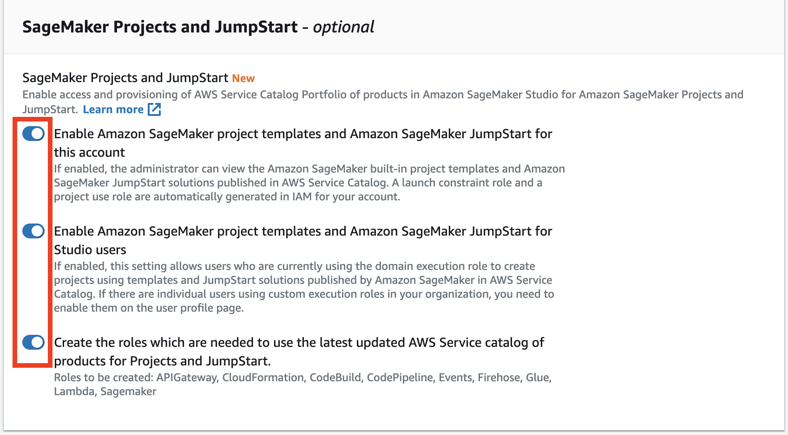

# Amazon SageMaker project template roles
To use the provided SageMaker projects you need to provision specific IAM execution roles as specified in [SageMaker Studio Permissions Required to Use Projects](https://docs.aws.amazon.com/sagemaker/latest/dg/sagemaker-projects-studio-updates.html).

The following roles are required to use the provided SageMaker project templates:

- Launch constraint role: `arn:aws:iam:::role/service-role/AmazonSageMakerServiceCatalogProductsLaunchRole`
- Product use role: `arn:aws:iam:::role/service-role/AmazonSageMakerServiceCatalogProductsUseRole`
- CloudFormation use role: `arn:aws:iam:::role/service-role/AmazonSageMakerServiceCatalogProductsCloudformationRole`
- CodeBuild use role: `arn:aws:iam:::role/service-role/AmazonSageMakerServiceCatalogProductsCodeBuildRole`
- CodePipeline use role: `arn:aws:iam:::role/service-role/AmazonSageMakerServiceCatalogProductsCodePipelineRole`
- Events use role: `arn:aws:iam:::role/service-role/AmazonSageMakerServiceCatalogProductsEventsRole`
- API Gateway use role: `arn:aws:iam:::role/service-role/AmazonSageMakerServiceCatalogProductsApiGatewayRole`
- Firehose use role: `arn:aws:iam:::role/service-role/AmazonSageMakerServiceCatalogProductsFirehoseRole`
- Glue use role: `arn:aws:iam:::role/service-role/AmazonSageMakerServiceCatalogProductsGlueRole`
- Lambda use role: `arn:aws:iam:::role/service-role/AmazonSageMakerServiceCatalogProductsLambdaRole`
- SageMaker use role: `arn:aws:iam:::role/service-role/AmazonSageMakerServiceCatalogProductsExecutionRole`

## Provision the required roles
There are two options to provision the required roles.

### Option 1 - SageMaker console
If you don't have a SageMaker domain in your account, you must create a new one. You must enable all options on the **SageMaker Projects and JumpStart** pane:



The SageMaker domain creates the required roles automatically.

If you already have a SageMaker domain in your account, follow [Shut Down and Update SageMaker Studio and Studio Apps](https://docs.aws.amazon.com/sagemaker/latest/dg/studio-tasks-update.html) instructions to update the domain. You must shutdown both JupyterServer and KernelGateway apps. After you shutdown all apps, go to Amazon SageMaker console, choose **Domains** on the left-side pane and select your domain. Go to **Domain settings**, click on **Configure app** on the **App** card. Make sure all options enabled on on the **SageMaker Projects and JumpStart** pane. Click through all **Next** in configuration panes and choose **Submit**. This will update the domain and create all needed project roles automatically.

### Option 2 - use CloudFormation template
Deploy the provided CloudFormation template [`cfn-templates/sagemaker-project-templates-roles.yaml`](cfn-templates/sagemaker-project-templates-roles.yaml). To deploy the roles you must have the corresponding permissions to create new IAM roles.

Run the following command in the command terminal from the project repository directory:

```sh
aws cloudformation deploy \
    --template-file cfn-templates/sagemaker-project-templates-roles.yaml \
    --stack-name sagemaker-project-template-roles \
    --capabilities CAPABILITY_IAM CAPABILITY_NAMED_IAM \
    --parameter-overrides \
    CreateCloudFormationRole=YES \
    CreateCodeBuildRole=YES \
    CreateCodePipelineRole=YES \
    CreateEventsRole=YES \
    CreateProductsExecutionRole=YES 
```